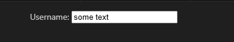
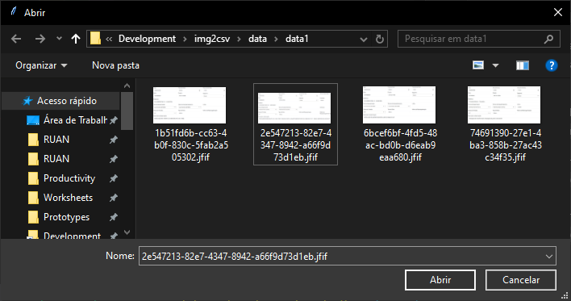
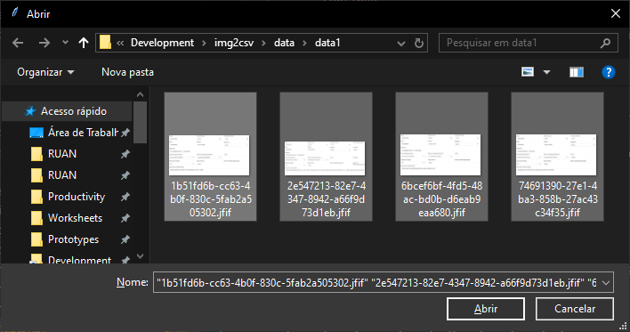

# IMG2CSV

O programa IMG2CSV é um wrapper Tesseract-OCR para transformar capturas de tela de formulários em tabelas CSV. O programa realiza a exclusão de cabeçalhos/respostas por meio de dois pontos no final de cada tag, por exemplo:



Este formulário simples com uma tag `Username:` ​​e um campo para o valor, que pode ser qualquer informação. Com base nos critérios previamente estabelecidos, `Username:` ​​será o cabeçalho da tabela e o valor de entrada `some text` será o seu valor.

## Instalação

O programa não precisa ser instalado, apenas descompacte o arquivo na pasta que desejar.

## Configuração

Para configurar, abra o arquivo `img2csv.conf` com o bloco de notas, você verá algo como abaixo:

```ini
TESSPATH=C:\Users\operador\Desktop\img2csv\tess\tesseract.exe
TESSDATA=C:\Users\operador\Desktop\img2csv\tess\tessdata
# Slice rows and cols (y1,y2,x1,x2) for Data, Nota, Inicio, ...
SLICES=0:90:0:400,91:190:0:400,...
```

Altere o caminho das configurações `TESSPATH` e `TESSDATA` para o caminho da pasta de instalação, onde o programa foi descompactado, por exemplo:

Exemplo 1: Se você descompactou na pasta `C:\Users\Operador\Downloads\img2csv\`:

* `TESSPATH` será `C:\Users\Operador\Downloads\img2csv\tess\tesseract.exe`
* `TESSDATA` será `C:\Users\Operador\Downloads\img2csv\tess\tessdata`

Exemplo 2: Se você descompactou na pasta `C:\Users\Operador\Desktop\img2csv\`:

* `TESSPATH` será `C:\Users\Operador\Desktop\img2csv\tess\tesseract.exe`
* `TESSDATA` será `C:\Users\Operador\Desktop\img2csv\tess\tessdata`

A configuração `SLICE` não deve ser alterada a não ser que você saiba o que está fazendo!

## Utilização

Após configurado, para utilizar é só executar o aplicativo com dois cliques, ou informar uma lista de arquivos no argumento do programa.

Se não for informado arquivos como argumento do programa, então o mesmo abrirá uma janela solicitando os arquivos, como na captura de tela abaixo:



Selecione todos os arquivos de uma só vez e clique em "Abrir", para o programa começar a iteração e coletar as informações.



> Dica: use `Ctrl + A` para selecionar todos os arquivos!

Após a coleta das informações, o mesmo gerará um arquivo `result.csv` na pasta do primeiro arquivo da lista.

## Solução de problemas

O erro `Tesseract-OCR is not installed on default path!` é causado por caminho incorreto na configuração `TESSPATH`. Verifique e acerte o caminho.

O erro `Failed loading language 'por' Tesseract couldn't load any languages!` é causado por caminho incorreto na configuração `TESSDATA`. Verifique e acerte o caminho.

O erro `Não foi possível abrir o arquivo (...)!` é causado por arquivo inválido. Verifique se todos os arquivos são imagens válidas e não estão corrompidos.

O erro `No objects to concatenate!` é causado por falta de arquivos válidos para coletar informação. Verifique se todas as imagens são formulários no padrão.

Outros erros não cobertos podem acontecer, nesses casos entre em contato comigo para esclarecimentos.
